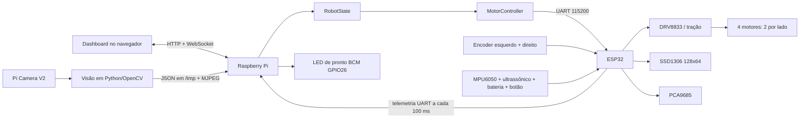

# Guia completo do projeto OBR2026K

> Documento vivo para apresentar, operar, testar e continuar o desenvolvimento
> do robô. Ele foi escrito a partir do código e das decisões registradas no
> repositório em 6 de agosto de 2026.

## Como usar este documento

Este guia separa informação confirmada pelo código de informação que ainda
precisa ser fornecida pela equipe:

- **Confirmado:** comportamento implementado ou configuração presente no repositório.
- **Em validação:** implementado, mas ainda depende de teste físico representativo.
- **PREENCHER:** informação mecânica, elétrica ou organizacional que não pode ser
  deduzida com segurança pelo software.

Quando uma informação mudar, atualize primeiro a fonte de verdade indicada e
depois revise este documento. Não copie números para vários arquivos sem
necessidade.

## Navegação rápida

- [Identificação e visão geral](#1-ficha-de-identificação)
- [Arquitetura](#3-arquitetura)
- [Hardware e alimentação](#4-hardware-conhecido)
- [Pinagem da ESP32](#5-pinagem-da-esp32)
- [Organização do software](#8-organização-do-repositório)
- [Motores e segurança](#10-controle-dos-motores)
- [Sensores e OLED](#12-sensores-e-periféricos-da-esp32)
- [Protocolo UART](#14-protocolo-uart-raspberry--esp32)
- [Autônomo e visão](#16-visão-computacional)
- [Dashboard e LED de pronto](#18-dashboard-da-raspberry)
- [Build, deploy e serviço](#20-dependências-e-build)
- [Operação e testes](#22-procedimento-recomendado-de-operação)
- [Diagnóstico](#24-diagnóstico-rápido)
- [Limitações e roadmap](#25-limitações-e-dívidas-técnicas-conhecidas)
- [Questionário para completar](#27-questionário-para-a-equipe-preencher)
- [Fontes de verdade](#29-fontes-de-verdade)

## 1. Ficha de identificação

| Campo | Informação atual |
| --- | --- |
| Nome do projeto | OBR2026K |
| Competição | Olimpíada Brasileira de Robótica — temporada 2026 |
| Objetivo geral | Robô móvel com quatro motores, visão computacional, sensores e controle autônomo/teleoperado |
| Equipe | **PREENCHER: nome oficial da equipe** |
| Escola/instituição | **PREENCHER** |
| Cidade/estado | **PREENCHER** |
| Modalidade e nível da OBR | **PREENCHER** |
| Integrantes e funções | **PREENCHER** |
| Professor/orientador | **PREENCHER** |
| Responsável por eletrônica | **PREENCHER** |
| Responsável por mecânica | **PREENCHER** |
| Responsável por software | **PREENCHER** |
| Repositório remoto | **PREENCHER: URL** |
| Branch principal | **PREENCHER** |
| Licença do projeto | **PREENCHER** |
| Contato da equipe | **PREENCHER** |
| Responsável por manter este guia | **PREENCHER** |
| Data da próxima revisão | **PREENCHER** |

## 2. Resumo do sistema

O robô usa duas unidades de processamento com responsabilidades diferentes:

- A **ESP32** controla diretamente motores, encoders, bateria, ultrassônico,
  botão, MPU6050, PCA9685 e OLED. Ela é a última autoridade de segurança antes
  dos drivers de motor.
- A **Raspberry Pi** executa a estratégia, processa a câmera, hospeda o dashboard,
  lê métricas do Linux e envia comandos de movimento para a ESP32 por UART.

Existem dois firmwares para a ESP32:

1. `obr_esp32_main`: versão principal, sem Wi-Fi, usada com a Raspberry Pi.
2. `obr_esp32_bridge`: versão de bancada, com ponto de acesso Wi-Fi e dashboard
   local para testar o hardware sem a Raspberry.

Os dois firmwares compartilham o mesmo núcleo de sensores, filtros, pinagem e
proteções. Isso reduz a possibilidade de um teste de bancada funcionar de forma
diferente do firmware usado no robô completo.

## 3. Arquitetura



### Fluxo de um comando manual

1. O navegador envia `drive` pelo WebSocket.
2. `DashboardServer` valida o tipo do comando e atualiza `RobotState`.
3. `RobotState` aceita movimento somente no modo manual e limita a faixa.
4. `MotorController` lê uma cópia do estado e envia `MOTOR` pela UART.
5. A ESP32 valida novamente o comando, aplica a regra dos dois lados, remapeia a
   faixa útil de PWM e escreve nos DRV8833.
6. Os encoders confirmam se ambos os lados responderam.
7. Um desequilíbrio confirmado aciona recuperação sincronizada; timeout e
   E-Stop continuam zerando imediatamente os quatro PWMs.

### Fluxo autônomo principal

1. A câmera captura e corrige a rotação da imagem.
2. O script Python detecta linha preta e marcações verdes.
3. O resultado é publicado em `/tmp/obr_camera_status.json`.
4. `LineFollower` verifica se os dados estão recentes.
5. A estratégia gera potência esquerda/direita dentro do modo autônomo.
6. O restante do caminho até os motores é igual ao controle manual.

## 4. Hardware conhecido

| Componente | Situação conhecida |
| --- | --- |
| Controlador de baixo nível | ESP32, compilada atualmente como `DOIT ESP32 DEVKIT V1` |
| Computador principal | Raspberry Pi; **PREENCHER modelo e revisão** |
| Câmera | Código preparado para Raspberry Pi Camera V2; **confirmar modelo físico** |
| Tração | Quatro motores, agrupados em lado esquerdo e lado direito; dianteiros e traseiros possuem comportamentos/modelos diferentes |
| Drivers | DRV8833 com PWM e nSLEEP |
| IMU | MPU6050 |
| Expansor PWM | PCA9685 em `0x40`, ainda sem atuadores definidos |
| Display | SSD1306 128×64, procurado em `0x3C` e `0x3D` |
| Distância frontal | Sensor ultrassônico; **PREENCHER modelo exato** |
| Encoders | Um conjunto quadrature por lado; **PREENCHER modelo e resolução** |
| Bateria | Níquel, nominal 12 V, referência visual de 10,5 V a 14,0 V |
| Alimentação dos motores | 8 V, conforme montagem atual |
| PCB | Placa própria; **PREENCHER revisão, autor e link do esquemático** |

### Informações mecânicas pendentes

> **PREENCHER:** estas informações afetam controle, odometria e testes.

| Campo | Valor |
| --- | --- |
| Massa total | **PREENCHER em kg** |
| Comprimento × largura × altura | **PREENCHER em mm** |
| Distância entre lados das rodas | **PREENCHER em mm** |
| Distância entre eixos | **PREENCHER em mm** |
| Diâmetro das rodas | **PREENCHER em mm** |
| Material das rodas | Borracha; **PREENCHER modelo/dureza** |
| Modelo dos motores dianteiros | **PREENCHER** |
| Modelo dos motores traseiros | **PREENCHER** |
| Relação da caixa de redução | **PREENCHER** |
| RPM nominal na tensão usada | **PREENCHER** |
| Torque nominal/estol | **PREENCHER** |
| Corrente nominal/estol | **PREENCHER** |
| Tipo de apoio adicional | **PREENCHER: rodízio, esfera, skid etc.** |
| Posição da câmera em relação ao chão | **PREENCHER altura e ângulo** |
| Posição e eixos do MPU6050 | **PREENCHER com foto ou desenho** |

## 5. Pinagem da ESP32

| GPIO ESP32 | Ligação | Função no software |
| --- | --- | --- |
| 32 | Ultrassônico TRIG | Pulso frontal de 10 µs |
| 33 | Ultrassônico ECHO | Captura por interrupção; deve permanecer até 3,3 V |
| 27 | Botão Start | `INPUT_PULLUP`, botão ligado ao GND |
| 14 | I2C SCL | Clock compartilhado a 400 kHz |
| 13 | I2C SDA | Dados compartilhados |
| 26 | DRV8833 nSLEEP | LOW desliga pontes; HIGH habilita após PWMs zerados |
| 5 / 18 | Motor esquerdo IN1 / IN2 | Um comando lógico para os dois motores esquerdos |
| 16 / 17 | Motor direito IN1 / IN2 | Um comando lógico para os dois motores direitos |
| 19 / 21 | Encoder esquerdo A / B | Quadrature nas quatro bordas |
| 22 / 23 | Encoder direito A / B | Quadrature nas quatro bordas |
| 1 | UART TX | ESP32 envia telemetria à Raspberry |
| 3 | UART RX | ESP32 recebe comandos da Raspberry |
| 36 | ADC da bateria | Divisor de 47 kΩ / 10 kΩ |

### Observações críticas da ESP32

- GPIO1 e GPIO3 também participam da gravação e da serial padrão. A Raspberry
  deve ficar desligada, desconectada ou silenciosa durante a gravação.
- GPIO36 é somente entrada e pertence ao ADC1, podendo funcionar junto com Wi-Fi.
- O ECHO de módulos ultrassônicos alimentados em 5 V precisa de adaptação para
  no máximo 3,3 V.
- A denominação esquerda/direita acima é a lógica final corrigida no software.
- O número 26 aparece também na Raspberry, mas são pinos de placas diferentes:
  ESP32 GPIO26 é nSLEEP; Raspberry BCM GPIO26 é o LED de pronto.

## 6. Pinagem da Raspberry Pi

| GPIO Raspberry (BCM) | Ligação | Função |
| --- | --- | --- |
| 14 / TXD | ESP32 GPIO3 / RX | Envia comandos UART |
| 15 / RXD | ESP32 GPIO1 / TX | Recebe telemetria UART |
| 26 | LED verde | Indica sistema pronto, ativo em HIGH |
| 21 / BOARD 40 | Iluminação da câmera | Ligada enquanto o script da câmera está ativo |
| GND | GND da ESP32 | Referência elétrica comum obrigatória |

> **PREENCHER:** tensão, resistor e modelo do LED verde; transistor ou estágio de
> potência usado na iluminação; diagrama da alimentação compartilhada.

## 7. Alimentação elétrica

### Confirmado

- A bateria é de níquel, nominalmente 12 V.
- O indicador considera 10,5 V como vazio e 14,0 V como cheio.
- Os motores estão sendo alimentados em 8 V.
- A bateria chega ao GPIO36 por um divisor de 47 kΩ e 10 kΩ, relação 5,7:1.
- O firmware faz média de 16 leituras ADC a cada 250 ms.
- A tensão é apenas telemetria: ainda não existe corte automático por bateria baixa.

### PREENCHER — diagrama de potência

- Capacidade da bateria: **____ mAh/Ah**
- Corrente máxima recomendada: **____ A**
- Modelo/revisão do regulador de 8 V: **____**
- Corrente máxima do regulador: **____ A**
- Tensão que alimenta ESP32: **____ V**
- Tensão que alimenta Raspberry Pi: **____ V**
- Fusível principal: **modelo/valor/local ____**
- Chave geral: **modelo/local ____**
- Proteção contra inversão: **____**
- Medição real do divisor contra multímetro: **fator de correção ____**
- Autonomia medida: **____ minutos**

Não ligue a bateria de até 14 V diretamente ao VM do DRV8833. A documentação
atual do projeto considera 10,8 V como limite superior do driver, portanto o
estágio de 8 V deve permanecer no circuito.

## 8. Organização do repositório

```text
CMakeLists.txt
  Build C++17 da aplicação principal da Raspberry.

include/obr/
  Interfaces e configuração central da Raspberry.

src/
  Implementação do dashboard, HAL, estado, estratégia e telemetria.

esp32/obr_esp32_main/
  Entrada do firmware principal sem Wi-Fi.

esp32/obr_esp32_bridge/
  Núcleo compartilhado e firmware de bancada com dashboard local.

scripts/camera_line_frame.py
  Captura, visão computacional, status JSON e stream MJPEG.

scripts/deploy.ps1 e scripts/deploy.sh
  Deploy atômico para a Raspberry.

scripts/run_robot.sh
  Supervisor do programa C++ e da câmera dentro do serviço.

scripts/obr-robot.service
  Unidade systemd iniciada automaticamente no boot.
```

### Responsabilidade dos módulos C++

| Módulo | Responsabilidade |
| --- | --- |
| `main.cpp` | Liga os módulos, executa o loop de 20 ms e coordena prontidão |
| `RobotState` | Guarda modo, missão, E-Stop, potências e idade do comando |
| `DashboardServer` | HTTP, WebSocket, interface, câmera e telemetria para navegador |
| `Esp32Bridge` | UART, parser de sensores e envio de comandos |
| `MotorController` | Converte estado seguro em mensagens para a ESP32 |
| `LineFollower` | Missão principal, verdes e giro de 90° |
| `Telemetry` | CPU, temperatura e RAM da Raspberry |
| `GpioPin` | Acesso simples ao GPIO Linux por `/sys/class/gpio` |
| `StatusLed` | LED de sistema pronto |

O binário ainda se chama `robot_test`, apesar de já ser a aplicação principal.
Uma renomeação futura pode melhorar a clareza, mas deve atualizar CMake, scripts,
serviço e documentação em conjunto.

## 9. Firmware da ESP32

### Firmware principal

Arquivo de entrada: `esp32/obr_esp32_main/obr_esp32_main.ino`.

Ele define `OBR_ESP32_RASPBERRY_MODE` e inclui o núcleo compartilhado. Nesse modo:

- não cria ponto de acesso Wi-Fi;
- não inicia servidor HTTP;
- não inclui o HTML do dashboard de bancada;
- recebe movimento somente pela UART da Raspberry;
- continua executando todos os sensores, OLED e mecanismos de segurança.

### Firmware de bancada

Arquivo: `esp32/obr_esp32_bridge/obr_esp32_bridge.ino`.

Ele cria uma rede Wi-Fi local e permite:

- habilitar/desabilitar motores;
- controlar por sliders, botões e WASD;
- observar sensores e periféricos;
- zerar encoders;
- calibrar o MPU6050;
- usar E-Stop sem Raspberry.

A credencial do ponto de acesso está atualmente definida no código. Não copie a
senha para documentos públicos. Antes de publicar o repositório, substitua-a por
configuração local ou confirme que é uma credencial descartável de bancada.

## 10. Controle dos motores

### Modelo lógico

O robô possui quatro motores, mas somente dois comandos de tração:

- `left`: controla os dois motores esquerdos;
- `right`: controla os dois motores direitos.

Os comandos usam a faixa `-1.0` a `1.0`. Zero para; o sinal escolhe o sentido.
A relação física de fios dentro de cada lado precisa permanecer igual para que
os dois motores do mesmo lado girem no mesmo sentido.

> **PREENCHER:** quantos DRV8833 físicos existem, quais canais alimentam cada
> motor e se há canais em paralelo. Anexar esquema da PCB e fotos identificadas.

### PWM

- Frequência: 20 kHz.
- Resolução: 10 bits.
- Duty máximo: 1023.
- Saída máxima: 100%.
- Comandos abaixo de 0,5% são tratados como zero.
- Reta: comandos úteis são remapeados linearmente para 55%–60%.
- Giro com os lados opostos: saída contínua entre 70% e 80%.
- Partidas e recuperações: pulso sincronizado de 100% por 180 ms.
- Nos testes pelo slider da Raspberry, os traseiros iniciaram em `0.05` e os
  dianteiros somente em `0.15`. Com o remapeamento anterior, isso correspondia a
  aproximadamente 62% e 66% de PWM físico. O pulso inicial atual fornece a
  margem de partida, enquanto a reta pode continuar em potência menor.

Esse remapeamento significa que `0.10` não equivale a 10% de PWM físico. Ele vira
55,5% em reta e 71% em giro. A interface mostra o valor aplicado pela ESP32.
Os quatro limites ficam em `include/obr/config.h` e são enviados pela Raspberry
em cada mensagem `MOTOR`, permitindo ajustá-los com deploy sem regravar a ESP32.

### Regra contra movimento unilateral

Se apenas um lado receber valor diferente de zero, Raspberry e ESP32 convertem o
comando em giro no próprio eixo, aplicando potência de módulo equivalente no
lado parado e sentido oposto. Isso evita arrastar duas rodas de borracha paradas.

### Proteção por encoders

Quando os dois lados recebem potência, a ESP32 compara o avanço normalizado:

- janela inicial: 250 ms;
- decisão somente após pelo menos quatro transições no lado que avançou;
- o lado mais lento deve alcançar ao menos 20% do progresso do outro;
- são necessárias duas janelas consecutivas para confirmar o desequilíbrio;
- após partidas e inversões, existe uma tolerância adicional de 450 ms;
- uma inversão zera ambos os lados por 15 ms sem baixar o nSLEEP;
- a recuperação aplica 100% nos dois lados por 180 ms;
- o comando original volta automaticamente, sem desarmar Manual ou Autônomo;
- recuperações adicionais são tentadas se o desequilíbrio continuar.

Essa proteção corrige atrasos transitórios sem transformar uma diferença normal
de partida em parada permanente. Ela compara os lados entre si; se ambos ficarem
completamente travados, não há um lado de referência e essa condição não é
atualmente classificada como desequilíbrio de tração.

## 11. Camadas de segurança

| Camada | Comportamento |
| --- | --- |
| Inicialização antecipada | GPIOs dos motores e nSLEEP são forçados para LOW antes do `setup()` |
| Startup normal | Driver só é habilitado após os quatro PWMs estarem em zero |
| Estado parado | Raspberry envia `STOP`; ESP32 zera os quatro PWMs |
| Limites | Raspberry e ESP32 limitam comandos a `[-1, 1]` |
| Regra bilateral | Um comando unilateral vira giro com os dois lados |
| Feedback de tração | Encoders acionam uma recuperação sincronizada sem baixar o nSLEEP |
| Timeout Raspberry | Após 2000 ms sem comando válido, `RobotState` zera potências |
| Timeout ESP32 | Após 500 ms sem comando, os PWMs são zerados |
| E-Stop | Tem prioridade sobre manual, autônomo e dashboard |
| Calibração | Para e trava motores até novo rearme explícito |
| Câmera desatualizada | Missão principal para quando o status passa de 400 ms |
| Telemetria ESP32 | Após 1000 ms, dados são considerados desatualizados |
| Encerramento | Serviço sinaliza o C++; programa envia `STOP` antes de sair |
| Deploy | Serviço é parado antes do build e o binário é trocado atomicamente |

O dashboard ajuda o operador, mas não é a autoridade final. A ESP32 deve
continuar segura mesmo se navegador, Wi-Fi, Raspberry ou UART falharem.

## 12. Sensores e periféricos da ESP32

### MPU6050

- Procurado em `0x68` e `0x69`.
- Acelerômetro configurado para ±8 g.
- Giroscópio configurado para ±500 °/s.
- Filtro interno configurado em 21 Hz.
- Leitura a cada 20 ms.
- Calibração usa 300 amostras com intervalo de aproximadamente 3 ms.
- Bias é calculado para os eixos Y e Z.

#### Yaw/giro integrado

- Gyro Z é convertido para graus por segundo.
- Filtro passa-baixas usa `alpha = 0,75`.
- Valores abaixo de `0,25 °/s` são tratados como ruído.
- O resultado é integrado e normalizado entre -180° e +180°.
- Como não há magnetômetro, o yaw pode acumular deriva com o tempo.

#### Inclinação de rampa

- Combina acelerômetro e gyro Y em filtro complementar.
- Constante de tempo: 0,50 s.
- Sinal atual: `+1,0`.
- A leitura depende da orientação física do MPU6050.

> **PREENCHER:** desenhar os eixos X/Y/Z do módulo instalado e registrar qual
> sinal representa subida e descida. Informar também o erro observado após 1,
> 5 e 10 minutos parado.

### Ultrassônico frontal

- Disparo a cada 100 ms.
- Pulso TRIG de 10 µs.
- Timeout de ECHO de 25 ms.
- Faixa aceita pelo software: 2 cm a 400 cm.
- Atualmente é exibido na telemetria, mas não participa da lógica autônoma.

> **PREENCHER:** modelo, tensão, divisor do ECHO, posição, ângulo e distância
> entre o sensor e a frente real do robô.

### Encoders

- Leitura quadrature nos canais A e B.
- Interrupção em todas as mudanças dos quatro sinais.
- Tabela de transição ignora mudanças inválidas.
- Contagem e taxa por segundo são enviadas à Raspberry.
- Taxa é atualizada a cada 250 ms.

> **PREENCHER:** pulsos por volta do encoder, contagens por volta após quadrature,
> relação com a roda, sentido positivo e milímetros por contagem. Sem esses dados
> ainda não existe odometria física em metros.

### Bateria

- ADC de 12 bits com atenuação de 11 dB.
- Média de 16 amostras.
- Divisor nominal de 47 kΩ / 10 kΩ.
- Sem fator de calibração específico da placa.
- Sem proteção automática por subtensão.

### PCA9685

- Endereço esperado: `0x40`.
- Frequência inicial: 50 Hz.
- Todos os 16 canais iniciam desligados.
- Nenhum servo ou mecanismo está implementado.

> **PREENCHER:** finalidade do PCA9685, canais, atuadores, limites de pulso,
> posições seguras, corrente da fonte e comportamento em E-Stop.

### OLED SSD1306

- Resolução: 128×64.
- Endereços testados: `0x3C` e `0x3D`.
- Atualização a cada 100 ms.
- Área principal: tensão da bateria.
- Barra: 10,5–14,0 V.
- Área inferior: yaw (`GIR`) e inclinação (`RMP`).
- Em OLED bicolor, título/barra ocupam a faixa amarela e a tensão fica abaixo da
  linha 16 para aparecer totalmente azul.
- Durante calibração, mostra animação, progresso, `NÃO MOVA` e resultado.

## 13. Botão Start físico

O botão está entre GPIO27 e GND com pull-up interno.

### Toque curto

- Debounce: 30 ms.
- Pressões menores que 80 ms são ignoradas.
- O evento é enviado somente ao soltar.
- Na Raspberry, inicia a missão autônoma selecionada se:
  - o robô estiver parado;
  - não houver E-Stop;
  - ESP32 e telemetria estiverem prontas;
  - nSLEEP estiver HIGH;
  - não houver calibração;
  - câmera estiver ativa e recente.

### Pressão por cinco segundos

- Para os motores.
- Zera encoders e referências de navegação.
- Zera yaw, inclinação, filtros e ultrassônico.
- Recalibra bias do MPU6050.
- Mantém a bateria disponível.
- Não gera o evento de toque curto.
- Mantém os motores travados até nova ação explícita.

## 14. Protocolo UART Raspberry ↔ ESP32

### Configuração

- Dispositivo Linux: `/dev/serial0`.
- Baud rate: 115200.
- Formato: 8N1.
- TX/RX cruzados e GND compartilhado.
- O console de login serial da Raspberry deve estar desativado.

### Comandos enviados à ESP32

```text
MOTOR,<left>,<right>,<emergency>,<straightMin>,<straightMax>,<turnMin>,<turnMax>
STOP
ESTOP
CLEAR_ESTOP
RESET_ENCODERS
CALIBRATE_SENSORS
PING
```

`MOTOR` aceita potências finitas entre -1,000 e 1,000. Os quatro limites também
devem permanecer ordenados e dentro de `[0, 1]`. Valores inválidos param os
motores e geram erro. O formato antigo com somente três campos continua aceito
e usa os padrões armazenados na ESP32.

### Eventos e respostas da ESP32

```text
READY
PONG
ERR,<reason>
CALIBRATION,START
CALIBRATION,DONE
CALIBRATION,FAILED
START_BUTTON,SHORT
TRACTION_RECOVERY,LEFT
TRACTION_RECOVERY,RIGHT
SENSOR,<campos CSV...>
```

### Ordem da telemetria `SENSOR`

```text
SENSOR,
distanceCm,gyroZ,yawZ,accelX,accelY,accelZ,mpuOk,
batteryV,leftEncoder,rightEncoder,startButton,pcaOk,
appliedLeft,appliedRight,leftRate,rightRate,
ramp,gyroX,gyroY,imuTemperature,oledOk,nSleepHigh,estop,
batteryAdcMillivolts,uptimeMs,calibrationActive,
tractionRecovery,tractionRecoverySide,
straightMinimum,straightMaximum,turnMinimum,turnMaximum
```

Valores de `tractionRecoverySide`:

- `0`: nenhuma recuperação ativa;
- `1`: lado esquerdo;
- `2`: lado direito.

Os campos extras são tratados como opcionais pelo parser da Raspberry para
preservar compatibilidade com versões antigas do firmware.

## 15. Estados e modos da Raspberry

| Modo | Significado |
| --- | --- |
| `stopped` | Potências zeradas; estado padrão |
| `manual` | Aceita `drive` do dashboard/WASD |
| `autonomous` | Aceita somente comandos gerados pela estratégia |
| `emergency` | E-Stop travado e potências zeradas |

Trocar a missão autônoma sempre força o modo parado. Comandos de drive não
mudam o modo por conta própria.

### Missões disponíveis

#### `main_mission` — padrão

Executa seguidor de linha e interpretação de marcações verdes.

#### `turn_right_90`

- Salva o yaw inicial do MPU6050.
- Comanda esquerda positiva e direita negativa.
- Alvo: 90°.
- Reduz potência nos últimos 25°.
- Tolerância de parada: 2°.
- Timeout: 3,5 s.
- Para se o MPU ficar indisponível.

> **Em validação:** potência, tolerância e inércia precisam ser confirmadas no
> piso real, com bateria em diferentes tensões. A medição angular atual usa o
> módulo da diferença; confirmar também o sinal físico do giro.

## 16. Visão computacional

Arquivo: `scripts/camera_line_frame.py`.

### Captura e publicação

| Parâmetro | Valor atual |
| --- | --- |
| Resolução do dashboard | 960×540 |
| Resolução de processamento | 320×180 |
| FPS alvo da câmera | 30 |
| Stream MJPEG | Porta local 8090, `/stream.mjpg` |
| Qualidade JPEG | 82 |
| Snapshot compatível | 2 FPS em `/tmp/obr_camera_frame.jpg` |
| Status JSON | 10 FPS em `/tmp/obr_camera_status.json` |
| Rotação | 180°, feita no pipeline com HFlip + VFlip |
| Iluminação | BOARD 40 / BCM21 ativa enquanto o script roda |

O dashboard principal faz proxy do MJPEG pela porta 8080, evitando que o usuário
precise acessar diretamente a porta 8090.

### Detecção da linha preta

- Ignora os 20% superiores da imagem.
- Usa canal V do HSV, blur Gaussiano e threshold invertido em 80.
- Aplica fechamento morfológico.
- Ignora contornos menores que 80 pixels na imagem reduzida.
- Entre contornos válidos, escolhe o mais próximo da posição anterior.
- O erro é `centro da linha - centro da imagem` em pixels da imagem principal.

### Detecção de verde

- Faixa HSV atual: `[35, 50, 40]` até `[90, 255, 255]`.
- Área mínima: 50 pixels na imagem reduzida.
- O verde só é validado se houver preto imediatamente antes dele.
- Verde à esquerda gera `ESQUERDA`.
- Verde à direita gera `DIREITA`.
- Verde nos dois lados gera `MEIA VOLTA`.

> **PREENCHER:** condições de iluminação usadas na calibração, amostras das cores
> da pista, câmera/óptica exata e conjunto de imagens de teste versionado.

## 17. Estratégia autônoma atual

### Seguidor de linha

- Potência base lógica: 0,30.
- Ganho proporcional: 0,0005 por pixel.
- Correção limitada a ±0,35.
- Se a linha sumir e existir erro anterior relevante, gira para o último lado.
- Potência de busca: 0,22.
- Deadband do erro anterior: 35 pixels.
- Se não houver direção anterior confiável, avança com metade da potência base.
- Se o JSON da câmera passar de 400 ms, para.

### Marcações verdes

1. Avança por 220 ms para aproximar o centro da interseção.
2. Gira com potência lógica 0,35.
3. Curva simples dura 650 ms.
4. Meia-volta dura 1200 ms.
5. Ignora novo verde por 900 ms após a manobra.

As manobras verdes são temporizadas, ainda sem fechamento por encoder ou IMU.

### Recursos ainda não usados pela missão principal

- Ultrassônico não interrompe movimento nem desvia de obstáculos.
- Inclinação de rampa é apenas telemetria/OLED.
- Encoders protegem tração, mas não fazem controle de velocidade ou odometria.
- PCA9685 não aciona mecanismos.
- Não existe lógica documentada para área de resgate, vítimas ou kit.

> **PREENCHER:** estratégia completa exigida pela modalidade da equipe e status
> de cada desafio do regulamento 2026.

## 18. Dashboard da Raspberry

### Rede

- Porta: 8080.
- URL típica: `http://raspberrypi.local:8080`.
- IP padrão atual do deploy Windows: `192.168.0.106`.
- WebSocket usa o mesmo host em `/ws`.
- Não há autenticação, TLS ou perfis de usuário; use somente em rede confiável.

### Controles

- `Manual`: libera teleoperação e envia `CLEAR_ESTOP` à ESP32.
- `Autônomo`: inicia a missão selecionada.
- `Parar`: zera movimento sem travar E-Stop.
- `E-Stop`: trava emergência.
- `Resetar e calibrar sensores`: para e calibra a ESP32.
- Seletor de missão: `MISSÃO PRINCIPAL` ou `GIRO 90° À DIREITA`.
- WASD: W/S para frente/ré; A/D para giro com os dois lados.
- Sliders: frente/ré e giro.

Perder foco, ocultar a aba, soltar teclas ou perder WebSocket zera comandos do
navegador. A segurança não depende apenas disso: os timeouts inferiores continuam
ativos.

### Telemetria exibida

- modo e missão;
- bateria e ADC;
- link, uptime e idade da ESP32;
- CPU, RAM e temperatura da Raspberry;
- câmera, FPS, linha, resolução e formato;
- potências solicitadas e aplicadas;
- contagens e taxas dos encoders;
- ultrassônico;
- MPU6050, yaw, rampa, gyro, aceleração e temperatura;
- PCA9685 e OLED;
- nSLEEP, E-Stop, calibração e recuperação de tração;
- LED de pronto, UART e timeouts.

## 19. LED de sistema pronto

O LED verde da Raspberry no BCM GPIO26 acende apenas quando:

- UART está aberta;
- telemetria da ESP32 está recente;
- nSLEEP está HIGH;
- não há E-Stop local da ESP32;
- não há calibração ativa;
- a câmera está ativa, com FPS maior que zero e status recente;
- o `RobotState` não está em emergência.

O LED não indica que a pista foi reconhecida ou que a bateria está carregada. Ele
indica que a infraestrutura necessária para iniciar está presente.

## 20. Dependências e build

### Raspberry Pi

- Compilador C++ com suporte a C++17.
- CMake 3.16 ou superior.
- pthread.
- Python 3.
- `python3-picamera2`.
- `python3-opencv`.
- `python3-numpy`.
- `RPi.GPIO`.

Build manual:

```sh
cmake -S . -B build
cmake --build build
```

No Windows o C++ também compila para verificação, mas a UART `/dev/serial0`, os
GPIOs e a Pi Camera só funcionam na Raspberry.

### ESP32 / Arduino IDE

Placa atualmente usada na compilação:

```text
DOIT ESP32 DEVKIT V1
FQBN: esp32:esp32:esp32doit-devkit-v1
```

Bibliotecas Arduino necessárias:

- Adafruit MPU6050;
- Adafruit Unified Sensor;
- Adafruit PWM Servo Driver Library;
- Adafruit GFX Library;
- Adafruit SSD1306.

Firmware principal para o robô:

```text
esp32/obr_esp32_main/obr_esp32_main.ino
```

Firmware de teste sem Raspberry:

```text
esp32/obr_esp32_bridge/obr_esp32_bridge.ino
```

### Uso de memória observado em 06/08/2026

| Alvo | Flash | RAM global |
| --- | --- | --- |
| ESP32 principal | 380.763 bytes (29%) | 24.848 bytes (7%) |
| ESP32 de bancada | 1.059.767 bytes (80%) | 49.684 bytes (15%) |

Esses números variam com a versão do ESP32 Arduino Core e das bibliotecas. O
firmware de bancada é bem maior porque inclui Wi-Fi, servidor HTTP e HTML.

## 21. Deploy e inicialização automática

### Windows

```powershell
.\scripts\deploy.ps1 -HostName 192.168.0.106 -Service
```

### Linux/macOS

```sh
bash scripts/deploy.sh --host raspberrypi.local --service
```

### Comportamento seguro do deploy

1. Para `obr-robot` antes de alterar código/binário.
2. Copia fontes e scripts.
3. Compila em `/home/obr/OBR2026K/.build-staging`.
4. Confirma que o novo `robot_test` não está vazio.
5. Instala como `robot_test.new`.
6. Faz `mv` atômico para o caminho final.
7. Reinstala a unidade systemd.
8. Habilita o serviço no boot.
9. Reinicia e exige estado `active`.

Se o build falhar, o executável anterior não é substituído e o robô permanece
parado.

### Serviço systemd

| Item | Valor |
| --- | --- |
| Nome | `obr-robot.service` |
| Usuário | `obr` |
| Grupo suplementar | `gpio` |
| Diretório | `/home/obr/OBR2026K` |
| Entrada | `scripts/run_robot.sh` |
| Reinício | sempre, após 2 s |
| Limite | 5 partidas em 30 s |
| Boot | `multi-user.target` |

No deploy validado em 06/08/2026, o binário principal da Raspberry ficou com
303.600 bytes, formato ELF ARM64/AArch64. Esse tamanho é apenas referência; a
validação do deploy verifica que o arquivo não está vazio, não exige um tamanho
fixo.

`run_robot.sh` recusa binário ausente, vazio ou sem permissão de execução antes
de iniciar câmera ou programa principal.

## 22. Procedimento recomendado de operação

### Antes de energizar

- [ ] Robô apoiado de forma segura ou rodas suspensas para primeiro teste.
- [ ] Bateria sem dano, inchaço, aquecimento ou conectores soltos.
- [ ] Polaridade e fusível conferidos.
- [ ] Nenhum cabo próximo às rodas.
- [ ] GND comum entre Raspberry, ESP32 e eletrônica de potência.
- [ ] UART conectada corretamente.
- [ ] ECHO do ultrassônico limitado a 3,3 V.
- [ ] nSLEEP conectado ao ESP32 GPIO26.
- [ ] Motores de cada lado giram no mesmo sentido elétrico.

### Ao ligar

1. Energize o robô com rodas suspensas após qualquer alteração de motor/PCB.
2. Observe que não há movimento durante o boot.
3. Aguarde o OLED terminar a calibração sem mover o robô.
4. Aguarde o LED verde da Raspberry.
5. Abra o dashboard.
6. Confirme bateria, ESP32 online, câmera ativa e ausência de falhas.
7. Faça um comando curto em baixa demanda lógica.
8. Só então coloque no piso.

### Para iniciar a missão

- Selecione a missão no dashboard; `MISSÃO PRINCIPAL` é o padrão.
- Use `Autônomo` ou toque curto no Start físico.
- O Start físico é ignorado se o sistema não estiver pronto.

### Para calibrar

- Deixe o robô completamente imóvel.
- Segure Start por cinco segundos ou use o botão no dashboard.
- Aguarde `PRONTO` no OLED.
- Faça novo rearme Manual/Autônomo.

### Para desligar

1. Pare o robô no dashboard.
2. Aguarde potências aplicadas em zero.
3. Encerre/desligue a Raspberry de forma limpa quando possível.
4. Desligue a alimentação de potência.

> **PREENCHER:** ordem física exata das chaves e conectores do robô.

## 23. Plano de testes

### Ordem segura

1. Build local.
2. Teste sem drivers/motores conectados.
3. Teste com rodas suspensas.
4. Teste com potência limitada.
5. Teste curto no piso.
6. Teste com bateria cheia e baixa.
7. Teste em piso semelhante ao da competição.

### Matriz de validação

| Teste | Status | Data/responsável/evidência |
| --- | --- | --- |
| C++ compila no Windows | Confirmado | **PREENCHER última execução registrada** |
| Firmware ESP32 principal compila | Confirmado | **PREENCHER versão Arduino/Core** |
| Firmware ESP32 bancada compila | Confirmado | **PREENCHER versão Arduino/Core** |
| Serviço inicia sozinho após reboot | Confirmado em 06/08/2026 | Raspberry em `192.168.0.106` |
| Dashboard responde na porta 8080 | Confirmado em 06/08/2026 | HTTP 200 |
| Câmera publica aproximadamente 30 FPS | Confirmado em 06/08/2026 | 31,45 FPS após aquecimento |
| LED pronto acompanha câmera + ESP32 | Confirmado em bancada | **PREENCHER vídeo/foto** |
| E-Stop zera os quatro motores | **PREENCHER teste físico** | |
| Timeout Raspberry zera motores | **PREENCHER** | |
| Timeout ESP32 zera motores | **PREENCHER** | |
| Recuperação do lado esquerdo é acionada | **PREENCHER** | |
| Recuperação do lado direito é acionada | **PREENCHER** | |
| Ambos os lados giram em W/S | **PREENCHER** | |
| Ambos os lados giram opostos em A/D | **PREENCHER** | |
| Giro de 90° para no alvo | **PREENCHER** | |
| Linha preta em diferentes luzes | **PREENCHER** | |
| Verde esquerda/direita/meia-volta | **PREENCHER** | |
| Rampa indica sinal correto | **PREENCHER** | |
| Bateria confere com multímetro | **PREENCHER** | |
| Autonomia completa de prova | **PREENCHER** | |

Não existem testes automatizados no CMake atualmente. `ctest` não encontra
casos cadastrados.

## 24. Diagnóstico rápido

### Sistema não inicia no boot

```sh
systemctl is-enabled obr-robot
systemctl is-active obr-robot
sudo systemctl status obr-robot --no-pager
journalctl -b -u obr-robot --no-pager
```

Verifique o binário:

```sh
stat /home/obr/OBR2026K/build/robot_test
file /home/obr/OBR2026K/build/robot_test
```

Um incidente anterior deixou `robot_test` com zero bytes. O deploy atual usa
staging, validação e troca atômica para impedir recorrência.

### Dashboard não abre

```sh
curl -I http://127.0.0.1:8080/
ss -ltnp | grep 8080
```

### Câmera não aparece

```sh
curl http://127.0.0.1:8080/camera-status.json
pgrep -af camera_line_frame.py
journalctl -u obr-robot -f
```

Confira `active`, `fps` e `error` no JSON.

### ESP32 aparece offline

```sh
ls -l /dev/serial0
fuser /dev/serial0
```

Confirme:

- console serial desativado;
- TX/RX cruzados;
- GND comum;
- baud rate 115200;
- firmware `obr_esp32_main` gravado;
- nenhuma outra aplicação usando a UART.

### Um lado não gira

1. Pare imediatamente.
2. Leia no dashboard qual potência foi solicitada e aplicada.
3. Observe contagem/taxa dos dois encoders.
4. Verifique o aviso de recuperação e o lado indicado.
5. Desligue a potência antes de trocar cabos.
6. Teste motor, saída do driver, conector e entrada da PCB separadamente.
7. Após corrigir, teste novamente com as rodas suspensas.

### OLED não aparece

- Verifique 3,3 V/GND e SDA13/SCL14.
- Procure `0x3C` e `0x3D` em scanner I2C.
- Confirme bibliotecas Adafruit GFX e SSD1306.
- Confirme que o construtor é 128×64.

### Bateria não confere

- Meça a bateria e o ponto ADC com multímetro.
- Confirme resistores de 47 kΩ e 10 kΩ.
- Confirme GND comum.
- Calcule e registre um fator de correção real.
- Nunca aplique a bateria diretamente no GPIO36.

## 25. Limitações e dívidas técnicas conhecidas

- Não há testes automatizados.
- Dashboard não possui autenticação ou HTTPS.
- Credencial do Wi-Fi de bancada está no firmware.
- `robot_test` é um nome provisório para o binário principal.
- Parser JSON do C++ é manual e simples, sem biblioteca dedicada.
- Manobras verdes são temporizadas.
- Ultrassônico ainda não influencia a estratégia.
- Bateria baixa não gera parada automática.
- Não há detecção explícita de travamento simultâneo dos dois lados.
- Não há controle fechado de velocidade por encoder.
- Não há odometria em distância física.
- Yaw do MPU6050 deriva por não usar referência absoluta.
- PCA9685 ainda não controla mecanismos.
- Parâmetros de visão ainda precisam de conjunto de imagens/testes reproduzíveis.
- Modelo mecânico e elétrico completo não está versionado neste repositório.
- O acesso GPIO da Raspberry usa `/sys/class/gpio`, interface considerada legada
  em kernels Linux recentes; funciona na configuração atual, mas deve ser
  acompanhado em futuras atualizações do sistema.

## 26. Roadmap sugerido

Esta lista é uma sugestão técnica, não uma decisão automática da equipe:

- [ ] Preencher toda a ficha mecânica e elétrica.
- [ ] Versionar esquemático, PCB e diagrama de potência.
- [ ] Registrar modelo e CPR dos encoders.
- [ ] Calibrar bateria contra multímetro.
- [ ] Criar testes automatizados para `RobotState`, protocolo e missões.
- [ ] Criar reprodução offline da visão com imagens gravadas.
- [ ] Fechar giro verde usando IMU/encoder, não somente tempo.
- [ ] Implementar detecção de travamento dos dois lados.
- [ ] Definir limite de bateria baixa e política segura.
- [ ] Integrar ultrassônico à estratégia quando a regra exigir.
- [ ] Definir mecanismos e limites do PCA9685.
- [ ] Documentar estratégia completa da modalidade OBR.
- [ ] Renomear `robot_test` quando a equipe decidir o nome final.
- [ ] Remover credencial do firmware antes de tornar o repositório público.

## 27. Questionário para a equipe preencher

### Mecânica

1. Qual é o modelo exato dos motores?
2. Qual é a relação de redução e o RPM em 8 V?
3. Qual é o diâmetro real das rodas sob carga?
4. Qual é a distância entre os centros dos lados esquerdo e direito?
5. Qual é a massa final e a distribuição aproximada de peso?
6. Onde ficam câmera, IMU, ultrassônico e centro de rotação?

### Eletrônica

1. Quantos DRV8833 físicos existem e como os quatro motores estão distribuídos?
2. O GPIO26 controla nSLEEP de todos os drivers ou somente de um?
3. Qual é a revisão da PCB?
4. Qual regulador gera 8 V e qual a corrente máxima?
5. Existem fusível, proteção de inversão e medição de corrente?
6. Qual é a capacidade e o modelo exato da bateria?
7. Como Raspberry e ESP32 são alimentadas?

### Sensores

1. Qual é o CPR efetivo de cada encoder após quadrature e redução?
2. Qual é o modelo do ultrassônico?
3. Como o MPU6050 está orientado fisicamente?
4. O OLED é realmente bicolor amarelo/azul em todas as unidades?
5. Quais atuadores serão ligados ao PCA9685?

### Software e prova

1. Qual modalidade/nível e quais desafios do regulamento precisam ser atendidos?
2. O que exatamente compõe a “Missão Principal” final?
3. Qual é o comportamento esperado em obstáculo, rampa, gap, verde e resgate?
4. Quais velocidades são seguras em cada trecho?
5. Quais testes já foram feitos e onde estão os vídeos/dados?
6. Quem pode alterar constantes de motor e segurança antes da prova?

## 28. Referência rápida

### URLs

```text
Dashboard: http://raspberrypi.local:8080
Dashboard pelo IP atual: http://192.168.0.106:8080
Status da câmera: http://raspberrypi.local:8080/camera-status.json
Stream pelo proxy: http://raspberrypi.local:8080/camera-stream.mjpg
```

### Comandos úteis no Windows

```powershell
# Deploy, build e restart seguro
.\scripts\deploy.ps1 -HostName 192.168.0.106 -Service

# Somente compilar C++ localmente
cmake -S . -B build
cmake --build build --config Release

# Ver estado remoto
ssh -i "$env:USERPROFILE\.ssh\obr_raspberry" obr@192.168.0.106 "systemctl status obr-robot --no-pager"
```

### Comandos úteis na Raspberry

```sh
sudo systemctl status obr-robot
sudo systemctl restart obr-robot
journalctl -u obr-robot -f
curl http://127.0.0.1:8080/camera-status.json
```

## 29. Fontes de verdade

| Assunto | Arquivo principal |
| --- | --- |
| Pinos e constantes da Raspberry | `include/obr/config.h` |
| Pinos e constantes da ESP32 | `esp32/obr_esp32_bridge/robot_config.h` |
| Segurança e sensores ESP32 | `esp32/obr_esp32_bridge/obr_esp32_bridge.ino` |
| Protocolo UART na Raspberry | `src/hal/esp32_bridge.cpp` |
| Estados e modos | `src/robot/robot_state.cpp` |
| Estratégias autônomas | `src/robot/line_follower.cpp` |
| Dashboard | `src/dashboard/dashboard_server.cpp` |
| Visão | `scripts/camera_line_frame.py` |
| Deploy Windows/Linux | `scripts/deploy.ps1` / `scripts/deploy.sh` |
| Startup | `scripts/run_robot.sh` / `scripts/obr-robot.service` |

## 30. Regra de manutenção deste guia

Atualize este documento quando ocorrer qualquer uma destas mudanças:

- troca de pino, driver, sensor, motor, bateria ou regulador;
- mudança de protocolo UART;
- novo modo ou missão;
- alteração de timeout ou limite de segurança;
- mudança de deploy, serviço ou endereço de rede;
- calibração relevante de visão, motor, encoder ou bateria;
- conclusão de um item marcado como `PREENCHER`.

Uma pessoa nova deve conseguir responder, somente com este guia e o repositório:

1. O que cada placa faz?
2. Como o robô é ligado sem movimento inesperado?
3. Como gravar, compilar e fazer deploy?
4. Como iniciar, parar, calibrar e usar E-Stop?
5. Onde alterar cada constante?
6. Como diagnosticar câmera, UART, sensor e motor?
7. Quais partes estão prontas e quais ainda dependem da equipe?
